# BandGap-TH

[English](README.md) | **ภาษาไทย**

**โทรศัพท์กำลังทำลายหลักฐานที่ใช้ตรวจจับเสียงปลอมภาษาไทยอยู่หรือไม่ — และตัดแบนด์วิดท์ได้มากแค่ไหนก่อนที่การตรวจจับจะพัง**

BandGap-TH เป็นข้อเสนอโครงงานสำหรับ YSC Thailand ที่แยกสองสิ่งที่โคเดกโทรศัพท์ทำกับเสียงออกจากกัน วัดว่าการตรวจจับเสียงปลอมภาษาไทยทนการตัดแบนด์วิดท์ได้มากเพียงใด และทดสอบว่าการฝึกด้วยเสียงที่ถูกจำกัดแบนด์วิดท์จะเรียกความสามารถกลับคืนมาได้หรือไม่

## ปัญหา

มิจฉาชีพเสียงปลอมในไทยติดต่อเหยื่อผ่านโทรศัพท์ และเส้นทางโทรศัพท์เป็นแบบ narrowband — G.711 จำกัดสัญญาณไว้ที่ราว 300–3400 Hz [3] ขณะที่ร่องรอยของ vocoder และ TTS ส่วนใหญ่อยู่ *เหนือ* ย่านนั้น โมเดลที่ฝึกด้วยเสียง wideband สะอาดจึงอาจกำลังพึ่งพาหลักฐานที่เครือข่ายลบทิ้งไปก่อนสายจะมาถึง

งานวิจัยก่อนหน้าแสดงว่าโคเดกทำให้การตรวจจับแย่ลง [2, 10] และการประเมินโทรศัพท์ภาษาไทยก็มีอยู่แล้ว [4, 12] **แต่ยังไม่มีใครแยกว่าเพราะอะไร** โคเดกโทรศัพท์ทำสองอย่างพร้อมกัน:

| | ทำอะไร | ผลที่ตามมา |
| --- | --- | --- |
| **การลดแบนด์วิดท์** | กรองความถี่เหนือราว 3.4 kHz ทิ้ง | หลักฐานถูก **ลบทิ้ง** ไม่มีการฝึกใดเรียกกลับมาได้ |
| **Companding** | แปลง 16-bit linear เป็น 8-bit logarithmic (A-law/μ-law) | หลักฐาน **ยังอยู่** แต่ถูกกลบด้วย quantization noise ซึ่งกู้คืนได้ |

ทุกงานที่ตีพิมพ์ใช้โคเดกทั้งก้อนแล้วรายงานตัวเลขเดียว ซึ่งคือผลรวมของทั้งสอง การรู้ว่าอันไหนเป็นตัวหลักจะชี้ว่าปัญหานี้แก้ได้ด้วยซอฟต์แวร์ หรือเป็นข้อจำกัดของโครงสร้างพื้นฐาน

## คำถามวิจัย

1. **การระบุสาเหตุ** — จาก EER ที่เพิ่มขึ้นเพราะการเข้ารหัส G.711 จำลองบนเสียงภาษาไทย มาจากการลดแบนด์วิดท์เท่าใด และจาก companding เท่าใด
2. **ความสัมพันธ์ปริมาณ-ผล** — ตัดแบนด์วิดท์ได้มากเพียงใดก่อนการตรวจจับจะพัง และที่ความถี่ตัดเท่าใด
3. **การบรรเทา** — การฝึกด้วยเสียงที่จำกัดแบนด์วิดท์กู้ความสามารถกลับมาได้หรือไม่ และเท่าใด

รวมกันคือ การวินิจฉัย การวัดปริมาณ และการพยายามแก้ไข

## สมมติฐาน

- **H1 — สาเหตุ:** การลดแบนด์วิดท์ส่งผลมากกว่า companding
- **H2 — ปริมาณ-ผล:** EER เพิ่มขึ้นแบบทางเดียวเมื่อความถี่ตัดลดลง และมีจุดพังที่ระบุได้
- **H3 — การบรรเทา:** การเพิ่มข้อมูลแบบจำกัดแบนด์วิดท์ลด `ΔEER` เทียบกับ baseline สถาปัตยกรรมเดียวกันที่ฝึกด้วยเสียงสะอาด

ทุกผลลัพธ์ให้ข้อมูลที่มีประโยชน์ ถ้า companding กลับเป็นตัวหลัก ปัญหาจะแก้ง่ายกว่าที่คาดมาก ซึ่งน่าประหลาดใจและมีประโยชน์กว่าคำตอบที่คาดไว้ ถ้าการเพิ่มข้อมูลกู้อะไรไม่ได้เลย นั่นคือหลักฐานโดยตรงว่าการสูญเสียเป็นเชิงสารสนเทศ ซึ่งยิ่งสนับสนุนการตีความด้านแบนด์วิดท์

## การออกแบบ



ไฟล์ต้นฉบับที่แก้ไขได้: [`docs/architecture.mmd`](docs/architecture.mmd)

**ชุดแยกสาเหตุ** — เสียงทดสอบแต่ละไฟล์สร้างครบทั้งสี่เงื่อนไข จับคู่กัน:

| ID | เงื่อนไข | ประกอบด้วย |
| --- | --- | --- |
| C0 | 16 kHz linear PCM สะอาด | อ้างอิง |
| C1 | 8 kHz **linear PCM** ไป-กลับ | แบนด์วิดท์อย่างเดียว |
| C2 | G.711 μ-law | แบนด์วิดท์ + companding |
| C3 | G.711 A-law | แบนด์วิดท์ + companding |

**C1 คือตัวควบคุมที่ทำให้โครงงานนี้เป็นไปได้** มันตัดย่านความถี่สูงทิ้งแต่คงความละเอียด 16 บิตไว้ครบ การลบมันออกจึงแยกผลของ companding ได้ ถ้าไม่มี C1 จะสังเกตได้แค่ผลรวม ซึ่งเป็นเหตุผลว่าทำไมยังไม่มีใครวัดสิ่งนี้

**ชุดกวาดความถี่** — ตัดความถี่ที่ 8000, 6000, 4000, 3400, 2500, 1500, 800 Hz

ชุดกวาดความถี่ **ไม่เปลี่ยนอัตราสุ่มเลย** ทุกอย่างอยู่ที่ 16 kHz ตลอด และเปลี่ยนเฉพาะความถี่ตัดของฟิลเตอร์ resampler จึงถูกเอาออกจากการทดลองไปเลย ไม่ใช่แค่ควบคุมไว้ ส่วนชุดแยกสาเหตุจำเป็นต้องผ่าน 8 kHz เพราะ G.711 บังคับ แต่ชุดกวาดไม่ต้อง จึงไม่ทำ

## ผลลัพธ์หลัก

```text
ส่วนของแบนด์วิดท์  = EER_C1 − EER_C0
ส่วนของ companding = mean(EER_C2, EER_C3) − EER_C1
ช่องว่างการระบุสาเหตุ = ส่วนของแบนด์วิดท์ − ส่วนของ companding

Recovery = (ΔEER_baseline − ΔEER_augmented) / ΔEER_baseline
```

การเปรียบเทียบแต่ละคู่ใช้ paired cluster bootstrap ตามไฟล์เสียงต้นทาง ขนาดตัวอย่างจึงเป็นจำนวนไฟล์เสียง ไม่ใช่จำนวนเงื่อนไข ซึ่งทำให้มีกำลังทางสถิติเพียงพอ

พร้อมกับกราฟความถี่ตัด และจุดพังที่กำหนดไว้ล่วงหน้าสองแบบ คือจุดที่ EER เพิ่มเป็นสองเท่า และจุดที่ EER ถึง 10%

## ความสำคัญนอกห้องทดลอง

ถ้าแบนด์วิดท์เป็นตัวหลัก ผลนี้มีนัยเชิงโครงสร้างพื้นฐาน:

> **โทรศัพท์ narrowband กำลังทำลายหลักฐานที่จำเป็นต่อการตรวจจับการฉ้อโกงด้วยเสียง**

โคเดก wideband อย่าง VoLTE หรือ VoIP ที่ใช้ Opus รักษาย่านความถี่ที่ร่องรอยอยู่ไว้ กราฟความถี่ตัดจะบอกปริมาณได้ชัดว่าโครงสร้างโทรศัพท์ narrowband แบบเดิมทิ้งความสามารถในการตรวจจับไปมากเพียงใด

## ระบบตรวจจับที่ใช้

| ระบบ | ขนาด | บทบาท | Tier |
| --- | --- | --- | --- |
| LFCC-GMM | ไม่ใช้โครงข่ายประสาท | เส้นฐานแบบดั้งเดิม | 1 |
| AASIST-L | ~85K | ตัวเลือกสำหรับใช้บนอุปกรณ์ และเป็นตัวทดสอบการบรรเทา | 1 |
| AASIST | ~297K | โมเดลเล็กสำหรับอ้างอิง | 1 |
| WavLM + AASIST back-end | ~94M | ตัวอ้างอิง SSL ขนาดใหญ่ | 2, ทางเลือก |

ไม่เสนอ architecture ใหม่ ชุดนี้มีไว้เพื่อแสดงว่าผลไม่ใช่สิ่งที่เกิดจากโมเดลเดียว

## สิ่งที่โครงงานนี้จะไม่กล่าวอ้าง

- ไม่กล่าวอ้างว่าศึกษา **โทรศัพท์จริง** สายจริงยังมี packet loss, jitter, การแปลงโคเดก ลักษณะไมโครโฟนของเครื่อง เสียงสะท้อนในห้อง และการปรับเกน ซึ่งไม่ได้ศึกษาที่นี่ งานนี้คือ G.711 จำลองแบบออฟไลน์
- ไม่กล่าวอ้างว่าเป็นการประเมินโทรศัพท์ภาษาไทยรายแรก ซึ่งเป็นของ [4, 12]
- ไม่กล่าวอ้างข้อโต้แย้งเรื่อง threshold transfer ซึ่งเป็นของ [19]
- ไม่กล่าวอ้างว่าเสนอ architecture ใหม่ หรือทำสถิติสูงสุดใหม่
- ไม่กล่าวอ้างว่าสามารถรองรับโมเดลสร้างเสียงที่ไม่เคยพบ
- ไม่ใช้คะแนนจากโมเดลเพียงค่าเดียวเป็นหลักฐานยืนยันว่าเสียงจริงหรือปลอม
- ไม่สรุปว่าผลใช้ได้กับผู้พูดภาษาไทยทุกคนหรือ deepfake ในอนาคตทั้งหมด

## เอกสารใน repository

- [`docs/research-plan.md`](docs/research-plan.md) — จุดยืนด้านความใหม่ เงื่อนไข สมมติฐาน สถิติ และข้อจำกัด
- [`docs/feasibility.md`](docs/feasibility.md) — แผน 12 สัปดาห์แบบแบ่ง tier พร้อมจุดตัดสินใจ
- [`docs/compute-request.md`](docs/compute-request.md) — ประมาณการทรัพยากรคำนวณเบื้องต้นและการขอใช้ allocation
- [`docs/ethics.md`](docs/ethics.md) — ความยินยอม การจัดการข้อมูล การสาธิตอย่างรับผิดชอบ และการเปิดเผยการใช้ AI
- [`docs/references.md`](docs/references.md) — เอกสารวิจัยและแหล่งข้อมูลทางการ

## สถานะ

อยู่ในขั้นข้อเสนอโครงงานและออกแบบการทดลอง ยังไม่มี training code ชุดข้อมูล prediction หรือ checkpoint ใน repository นี้

## ใบอนุญาต

ข้อความต้นฉบับและโค้ดในอนาคตใช้ MIT License ส่วนข้อมูล โมเดล มาตรฐาน และซอฟต์แวร์ภายนอกเป็นไปตามใบอนุญาตและข้อจำกัดของเจ้าของแต่ละราย
